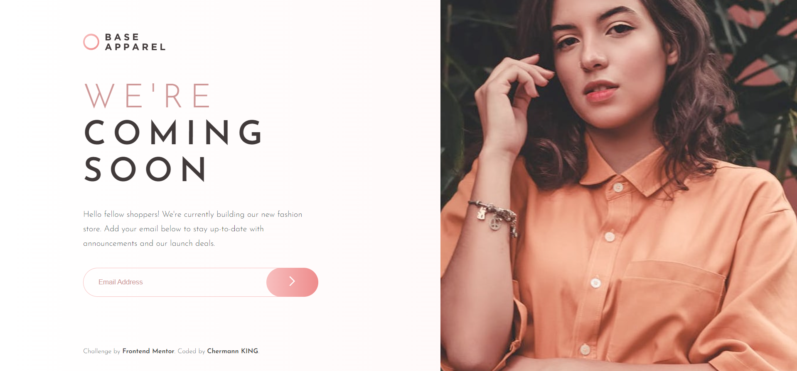

# Frontend Mentor - Results summary component

This is the [Base Apparel coming soon page](https://www.frontendmentor.io/challenges/base-apparel-coming-soon-page-5d46b47f8db8a7063f9331a0). Frontend Mentor challenges help improve coding skills by completing realistic projects.

## Welcome! 👋

Thanks for taking a look at my solution to this front-end coding challenge.

## Table of contents

- [Overview](#overview)
  - [Screenshot](#screenshot)
  - [Links](#links)
  - [Built with](#built-with)
- [Author](#author)

### Screenshot

### Links

- Solution URL: https://github.com/Chermann-KING/base_apparel_coming_soon---NEWBIE
- Live Site URL: URL_LIVE

### Built with

- Semantic HTML5 markup
- CSS custom properties
- Mobile-first workflow
- Client Side validation using JS

## Author

- Website - [Hermann MOUSSAVOU](https://hermann-moussavou.com)
- Frontend Mentor - [Chermann KING](https://www.frontendmentor.io/profile/Chermann-KING)
- LinkedIn - [Hermann MOUSSAVOU](https://www.linkedin.com/in/hermann-moussavou)
